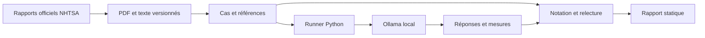

# AutoEval — Benchmark de LLM pour la qualité automobile

**Comparer des modèles locaux sur des rapports réels, avec des résultats que l’on peut examiner et reproduire.**

AutoEval transforme des dossiers publics de rappel automobile en tests d’extraction, d’analyse chronologique et de synthèse sourcée. Le projet couvre le parcours **besoin métier → cas de test → notation → exécution → analyse**, dans l’esprit d’un stage de benchmarking de LLM pour les équipes Qualité et Planification du Développement Produit.

> **Version pilote 0.1.0.** Trois rapports authentiques, neuf cas documentés, deux LLM exécutés localement. Les résultats sont réels, mais le corpus reste petit et les références attendent une validation humaine indépendante. Projet personnel sans affiliation à Stellantis, aux constructeurs ou à la NHTSA.

[Comprendre le projet](docs/PROJECT_BRIEF.md) · [Lire les résultats](docs/PILOT_RESULTS.md) · [Examiner la méthode](docs/METHODOLOGY.md) · [Parcourir la documentation](docs/README.md)

## Le projet en une minute

| Élément | Réalisation actuelle |
|---|---|
| Documents | 3 rapports NHTSA, 17 pages, versions et empreintes conservées |
| Tâches | Extraction de caractéristiques ; distinction entre événements et prévisions ; synthèse qualité |
| Cas | 3 de mise au point + 6 de pilote, séparés par campagne de rappel |
| Modèles | Qwen `qwen3:1.7b` et Llama `llama3.2:3b`, quantification Q4_K_M |
| Expérience pilote | 6 cas × 2 modèles × 3 répétitions = 36 réponses de LLM |
| Comparaison simple | 2 sorties d’une extraction par règles, sur les mêmes cas d’extraction |
| Coût mesuré | 0 € de frais d’API ; énergie et matériel non chiffrés |
| Restitution | Tableau de bord statique, réponses brutes, sources, mesures et rapport |

**Pourquoi ce projet ?** Une réponse fluide peut confondre une date prévue avec un événement réalisé, inventer une information absente ou citer un passage qui ne justifie pas sa conclusion. AutoEval rend ces problèmes visibles avant d’envisager un usage métier.

## Consulter la démonstration sans télécharger de modèle

Il suffit de Python 3.11 ou ultérieur. Ces commandes utilisent les résultats déjà mesurés : **aucune inférence, aucun téléchargement de corpus et aucune dépendance Python supplémentaire**.

```bash
git clone https://github.com/jules009X/autoeval-llm-benchmark.git
cd autoeval-llm-benchmark
python3 scripts/preview_results.py
python3 -m http.server 8080 --bind 127.0.0.1 --directory site
```

Ouvrir [la démonstration locale](http://127.0.0.1:8080). Elle permet de comparer les tâches, filtrer les modèles, lire chaque réponse et examiner les références. `Ctrl+C` arrête le serveur. Le site n’est pas encore hébergé publiquement : cette URL fonctionne sur la machine qui lance la commande.

Pour vérifier uniquement la cohérence des résultats fournis :

```bash
python3 scripts/preview_results.py --verify-only
```

Résultat attendu : **2 campagnes d’exécution et 42 observations** — 38 dans le pilote, 4 dans la mise au point. Une observation peut être une réponse tronquée ou une erreur ; le fichier ne conserve pas uniquement les réussites. Cette vérification recalcule les agrégats, elle ne remplace pas la relecture sémantique des réponses.

## Ce que montre le premier pilote

| Configuration | Extraction : champs conformes¹ | Chronologie : champs conformes¹ | Synthèse : qualité sémantique |
|---|---:|---:|---|
| Qwen 3, tag `1.7b` | 0,0 % | 40,0 % | Non notée : relecture requise |
| Llama 3.2, tag `3b` | 63,3 % | 50,0 % | Non notée : relecture requise |
| Règles sur labels | 80,0 % | Hors périmètre | Hors périmètre |

¹ Le score exige la structure `value/page/quote` demandée. **Qwen fournit certaines valeurs justes mais les place dans un format incompatible** : son score nul en extraction ne signifie pas que tous les faits sont faux. Les réponses tronquées et échecs comptent pour zéro. Une synthèse bien structurée n’est pas automatiquement fidèle.

Les règles retrouvent quatre champs explicitement étiquetés sur cinq et s’abstiennent sur le fournisseur. Elles ne sont pas évaluées sur les autres tâches. Ces résultats ne justifient ni un classement général des modèles ni une conclusion industrielle. [Rapport complet et exemples d’erreurs](docs/PILOT_RESULTS.md).

## Données réelles et traçabilité

| Campagne | Version du rapport | Ensemble | Sujet | Original |
|---|---|---|---|---|
| 24V-720 | 27 septembre 2024 | Mise au point | Batteries haute tension | [PDF NHTSA](https://static.nhtsa.gov/odi/rcl/2024/RCLRPT-24V720-8602.PDF) |
| 24V-436 | 30 janvier 2025 | Pilote | Caméras de recul | [PDF NHTSA](https://static.nhtsa.gov/odi/rcl/2024/RCLRPT-24V436-2012.PDF) |
| 19V-627 | 1er juin 2020 | Pilote | Airbags passager | [PDF NHTSA](https://static.nhtsa.gov/odi/rcl/2019/RCLRPT-19V627-7873.PDF) |

Aucun fait, planning ou événement n’a été inventé. Les **questions et annotations** sont créées pour l’évaluation ; les documents sont authentiques. Les rapports sont historiques et ne constituent pas des conseils actuels aux propriétaires.

- [Manifeste des sources](data/manifest.json) : URL, dates, empreintes des PDF et du texte extrait.
- [Catalogue de cas](data/cases.json) : consignes, champs, références, citations, complexité et criticité.
- [Versions des modèles observées](data/models.lock.json) : empreintes, quantifications et moteur.
- [Réponses et mesures publiées](results/pilot-v0.1.json) : export du pilote et de la mise au point.
- [Fiche de données](docs/DATA_CARD.md) : transformations, provenance et conditions de réutilisation.

Les PDF intégraux, les textes extraits, les poids et les environnements locaux sont exclus du dépôt. Leur accès public n’est pas assimilé à une licence générale de redistribution.

## Architecture



Le moteur utilise la bibliothèque standard Python. `pypdf` sert uniquement à préparer le corpus. L’interface est en HTML/CSS/JavaScript sans framework, sans compte visiteur et sans serveur d’inférence public. [Architecture et choix techniques](docs/ARCHITECTURE.md).

## Reproduire une exécution locale

Pré requis : Python 3.11+, `curl`, un [moteur Ollama](https://ollama.com/download) local et suffisamment de mémoire et de disque. Le pilote a été exécuté sur Apple M3 Pro avec 18 Gio ; ce n’est pas une exigence minimale universelle. Les deux modèles occupent environ 3,4 Go, hors moteur et contexte.

Depuis la racine du dépôt, sur macOS ou Linux :

```bash
python3 -m venv .venv
source .venv/bin/activate
python -m pip install '.[corpus]'
python scripts/prepare_corpus.py
python -m autoeval validate
python -m unittest discover -s tests -v
```

Démarrer Ollama si nécessaire, puis télécharger explicitement les modèles :

```bash
ollama pull qwen3:1.7b
ollama pull llama3.2:3b
```

Faire un essai de mise au point, puis le pilote :

```bash
python -m autoeval run --model qwen3:1.7b --split dev --baseline
python -m autoeval run --model qwen3:1.7b --model llama3.2:3b --split pilot --repeats 3 --baseline --timeout 300
```

Le runner affiche le répertoire `data/runs/<run_id>/`. Utiliser cet identifiant pour exporter la nouvelle expérience :

```bash
python -m autoeval export --run data/runs/REMPLACER_PAR_RUN_ID --dest site
python -m http.server 8080 --bind 127.0.0.1 --directory site
```

Le protocole demande le même format par prompt aux modèles ; il **n’impose pas un JSON Schema au décodage**. Les poids, versions, graines, prompts et conditions doivent accompagner toute comparaison. Une répétition n’est pas une garantie de sortie identique. [Guide complet de reproduction et dépannage](docs/REPRODUCIBILITY.md).

## Vérification et qualité

La suite vérifie les valeurs absentes, les formats erronés, les citations, l’isolation des ensembles, les flux incomplets, les agrégats et la sécurité d’insertion des résultats dans le HTML. Le workflow [Verify benchmark](.github/workflows/test.yml) est prévu pour exécuter ces contrôles sur GitHub sans télécharger de LLM.

Ces tests valident le **logiciel**. La qualité métier des références et des synthèses nécessite une [relecture humaine distincte](docs/HUMAN_REVIEW.md). [Plan de validation](docs/VALIDATION.md).

## Périmètre et suite

- Réalisé : corpus sourcé, catalogue, runner local, mesures, comparaison par tâche, résultats inspectables et documentation.
- À compléter : corpus plus large, double annotation, notation humaine des synthèses, nouvel ensemble final, recommandations métier et hébergement public.
- Hors périmètre actuel : entraînement de modèles, données internes Stellantis, planification interne du développement produit, benchmark sous charge et coût énergétique.

Le projet démontre une méthode transférable aux tâches de l’offre ; il ne prétend pas reproduire les processus internes de l’entreprise. [Correspondance détaillée avec le stage](docs/PROJECT_BRIEF.md) · [Feuille de route](docs/ROADMAP.md).

## Documentation et contribution

Le [sommaire de la documentation](docs/README.md) propose un parcours recruteur, un parcours utilisateur et un parcours contributeur. Pour apporter une modification, lire [CONTRIBUTING.md](CONTRIBUTING.md) et conserver les résultats historiques. Les évolutions sont consignées dans [CHANGELOG.md](CHANGELOG.md).

Développé avec une assistance IA. Les observations sont issues d’exécutions réelles ; les annotations restent à valider indépendamment. Le code est sous [licence MIT](LICENSE), à l’exclusion des documents et des modèles tiers.

**English overview:** AutoEval is a local LLM evaluation pilot using real, versioned automotive recall reports. It includes traceable references, repeated inference, strict structured-output checks, latency measurements and a static results explorer. The published dataset is small; independent annotation review and semantic evaluation of summaries are still pending.
