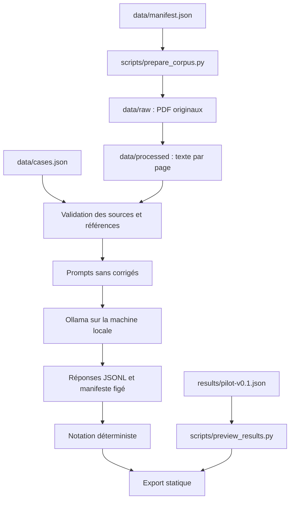

# Architecture et choix techniques

[Sommaire](README.md)

## Flux de données

## Responsabilités

| Fichier | Responsabilité | Point à examiner |
|---|---|---|
| `autoeval/core.py` | Chargement, empreintes, prompts, comparaisons et citations | Les références ne sont pas insérées dans `make_prompt` |
| `autoeval/providers.py` | Client Ollama en streaming et baseline à expressions régulières | Erreurs du moteur, fin de flux, paramètres, mesures |
| `autoeval/runner.py` | Ordonnancement, répétitions, snapshots et journalisation | Une campagne distincte par lancement, pas de retry silencieux |
| `autoeval/report.py` | Agrégation et export des campagnes locales | Échecs inclus ; pas de score sémantique inventé |
| `autoeval/cli.py` | Interface en ligne de commande | `validate`, `run`, `export` |
| `scripts/prepare_corpus.py` | Téléchargement et extraction des versions attendues | Refus d'une empreinte inattendue |
| `scripts/preview_results.py` | Consultation de l'expérience publiée | Recalcule les agrégats sans télécharger les sources |
| `web/` | Navigation dans les résultats | Affichage des données comme du texte, filtres et liens officiels |

## Pourquoi ces choix ?

**Bibliothèque standard Python.** Le moteur reste lisible et utilisable sans empiler des frameworks d'évaluation. `pypdf` est isolé à la préparation du corpus. Cette simplicité permet d'expliquer les calculs en entretien ; elle implique aussi de documenter précisément les limites des contrôles maison.

**Ollama local.** Répond à la contrainte d'absence d'API payante. Les deux poids utilisés sont locaux. Le connecteur n'accepte que des adresses de boucle locale. Pour ce profil, le serveur peut être lancé avec `OLLAMA_NO_CLOUD=1` ; une adresse locale ne doit pas être présentée à elle seule comme une preuve universelle d'absence de relais cloud.

**JSONL pour les réponses.** Chaque tentative est écrite puis vidée sur disque sans attendre la fin du benchmark. Le manifeste décrit l'expérience et son état. Les résultats interrompus restent distincts d'une campagne terminée. Une coupure forcée du processus peut toutefois laisser l'état `running` : inspecter le nombre de lignes avant réutilisation.

**Rapport statique.** La consultation ne déclenche aucun appel de modèle. Elle peut donc être hébergée sans serveur GPU. Les mesures proviennent d'exécutions enregistrées ; aucun score n'est calculé à partir d'une démonstration simulée.

**Format JSON demandé par prompt.** Le pilote évalue notamment le respect des consignes de structure. Le client demande du JSON à Ollama, sans schéma contraignant les champs. Une future expérience avec JSON Schema devra être identifiée comme une autre condition expérimentale.

## Frontières et limites

Les documents ne sont pas des instructions à exécuter. Ils sont délimités dans le prompt ; aucune sortie de modèle n'est exécutée comme du code. Le modèle n'utilise ni outils ni recherche web. Cela ne constitue pas une étude complète des injections de prompt.

Une réponse tronquée conserve le texte reçu. Une erreur du moteur pendant le streaming est enregistrée, mais le client actuel ne conserve pas les fragments partiels déjà reçus avant cette erreur. Cette limite est distincte de la conservation des réponses terminées et doit être corrigée dans une future version.

Le moteur n'évalue pas automatiquement la fidélité d'une synthèse ni la pertinence sémantique d'une citation. L'export public ne contient pas les prompts complets, car ceux-ci incorporent le texte intégral des documents ; les campagnes locales conservent ces prompts. Le hash du prompt reste publié.
